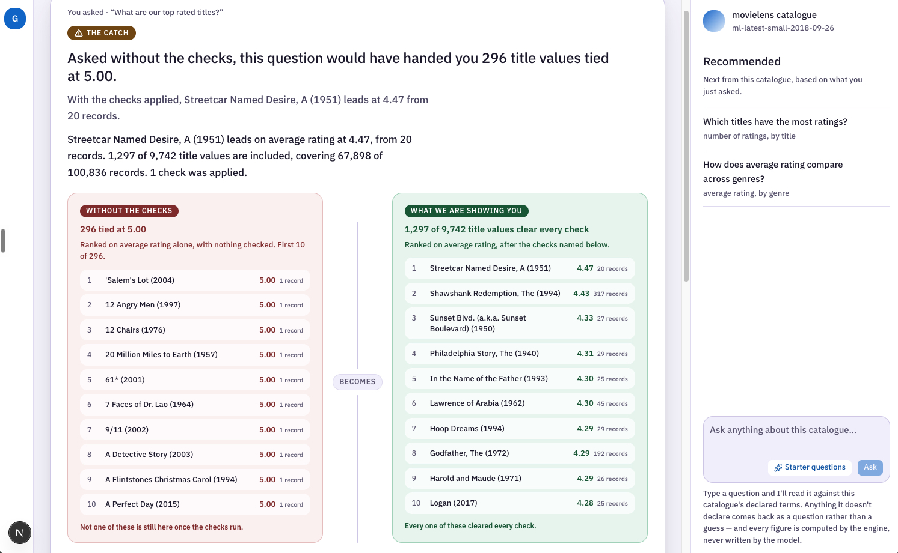
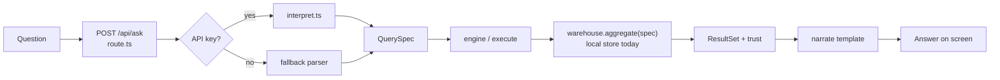

# Overview

This application is an AI-native analytics framework designed for non-technical business users. Its core value focus on catching the confident wrong answer that a non-technical user cannot audit. This document provides a high-level overview of the system purpose, the trust thesis, the architectural layout.

## **Purpose & Trust Thesis**

Traditional text-to-SQL solutions often suffer from silent failures where queries return incorrect figures and non-technical users accept blindly. The app addresses this through the trust thesis: `AI interprets, never computes`. The AI model translates natural language questions into a typed `QuerySpec` . All data aggregation, filtering, sorting, and guard applications are handled by a deterministic execution engine and every calculated number comes strictly from the computed `ResultSet`.

The product never simply tells you a result is trustworthy. It shows you both answers. Ask "What are our top rated titles?" and the naive answer is **296 titles tied at a perfect 5.00**, every one of them with one rating. The guarded answer is ***A Streetcar Named Desire* at 4.47 from 20 ratings**, then *The Shawshank Redemption* at 4.43 from 317. The reason the two disagree: **86.7% of this catalogue has fewer than 20 ratings**, so the naive list is noise for almost the whole dataset, and the app shows you the reason and the improvement before you read the first line.



---


## How to run

Requires **Node.js 22+** (Next 16 / native TypeScript stripping for `npm run ingest`). The app still runs without the AI api key but the chatbox will be disabled. It shows starter questions work, numbers come from the engine, interpretation uses the deterministic fallback, narration uses a template.

```bash
# 1. Install, then compile the MovieLens CSVs into the local store (creates .store/, not committed)
npm install
npm run ingest
```

```bash
# 2. Optional: free typing in the question box
cp .env.example .env.local
# edit .env.local and set ANTHROPIC_API_KEY=...
```

```bash
# 3. Start the app
npm run dev
# → http://localhost:3000
```

```bash
# Tests
npm test
```

---


## Dataset

[MovieLens](https://files.grouplens.org/datasets/movielens/ml-latest-small.zip) is the provided data, checked in under [data/](data/). 

---


## Why I built this

While I did the market research, I found the space splitting into four segments: file-first, AI-native, incumbent+AI and warehouse-native and all racing focuses on the same axis of query accuracy or conversational range. So, I picked the one most tools skip: the AI's value is not answering the question you asked. It is telling you that the question you asked would have misled you. The project focuses on these 3 rules:

- AI interprets, never computes.
- The recipe is read, never authored.
- Trust is the proof

***The pitch - "it catches what you'd have missed".*** The market research (`docs/market-research.md`) shaped the positioning.

The demo uses the provided dataset, but I built the **architecture in production-shaped**: plain language commands a query engine (`QuerySpec` → engine → `warehouse.aggregate(spec)`), the same family as warehouse-native tools. Local store today, a real warehouse later, without rewriting how the AI is used.

---


## High-level Architecture

The app chooses to use Next.js App Router: one app for the screen and `POST /api/ask`.

### Frontend

Look, behaviour, and ownership are three layers and do not compete with each other. Tailwind and CSS variables in `globals.css` carry the theme (design-system tokens mapped onto the names shadcn’s components read) and set at the start. So the next component does not arrive without theming. Radix is only for the interactive pieces supporting accessibility for dialog, drawer, popover: focus trap, Escape, keyboard. Shadcn is the glue: the CLI copies React source into `src/components/ui`, already wired to those primitives, so I can read and change it. A new component can be added anytime when a screen needs it.

### Server

The route loads the store and the semantic layer. A `QuerySpec` is the recipe: the model writes it, Zod checks it, the engine runs it. If a question uses a word the layer does not know, the app does not guess the closest thing. It asks a clarifying question instead, and that is a normal answer, not an error.

The warehouse answers `aggregate(spec)` with one small table, not raw rows. Today, we have a local store compiled from CSV dataset.  Postgres is the second adapter, but only in the tests. The same cases run on both engines and the numbers must match exactly. So a clone still runs with no key and no database. 

AI uses the Anthropic SDK directly, not an agent framework. This is a typed command into a query engine, not an SQL agent that runs on its own. The Zod schema I send to the API as the output format is the same one that checks the response, so there is no second schema to drift. The prompt cache sits on a prefix I control.

Natural language is a **command** into a query engine. The AI never computes a number.




1. **Interpret**: turn English into a `QuerySpec`: one structured recipe (what to measure, how to break it down, which checks apply). AI does that when a key is present; without a key, a small parser handles the starter questions and the words the layer declares.
2. **Engine**: run recipes the same way every time. It applies the checks, sort, and row cap. If the checks change who is on top, the answer shows both rankings: the naive one and the honest one.
3. **Warehouse**: fetch one aggregated table for that recipe. The engine never looks at raw rows.
4. **Narrate**: write the takeaway from that small table (~20 rows) and the trust report. Today a template does this. When the model does it, it sees the same small table and nothing else, so no number can come from the model.

---


## How I used AI

I started with market, tech stack, UI mock, and a build spec in `docs/`, then coded under [AGENTS.md](AGENTS.md). One captain agent held the plan I spun a worker per task. I used Claude Design at the start so the screens shared one visual language instead of restyling each increment. Each increment was a GitHub issue and a PR. Review was a separate pass. What we decided, and why, is in [docs/how-this-was-built.md](docs/how-this-was-built.md). 

The AI proposed options. I asked questions back and we narrowed them. We measured instead of trusting summaries. When a measurement disagreed with the plan, we updated the design first, then the code. Here is some decisons I made:

- **Postgres as the second engine.** I pushed for a real database; the AI recommended putting it behind the conformance suite rather than in the serving path. 
- **Stopping the demo at twelve of sixteen increments.** The cut was made on the dependency graph, not on time. The six are deferred for next phase. 
- **The banner on the first screen, against the AI's own rule**. It stays a labelled mock since building a complete system will need more time.
- Chose shadcn after comparing it with a Tailwind+Radix-only path.
- Demoted the chatbot to the side so the naive/honest catch could lead the screen.

---


## Time spent, and where the build stops

One day of building, Friday Sep 18 and I went past it on purpose. The interesting part of this problem is the part that does not fit in 45 minutes: proving the number is right.

The build stops at position 12 of 16. GA-11, the tappable recipe sentence, is the next increment and has not been implemented yet. The rest of issues are on the Github issue tracker.

---


## What I'd do with more time

1. **Wire the first-screen banner to the engine**, so it is a real proactive alert and not a labelled mock.
2. **Targets and goal alerts.** A user should be able to set a target and the app warns when the trend will miss it.
3. **Advanced insight suggestions** shaped by what the user has already asked.
4. **A compact query syntax for advanced users**, so the same engine has two front doors: plain English for most people, a query language for the few who want it.

Next, I’d wire what’s already designed: save recipes, accept new data deliveries, run the same spec against a real warehouse, and turn misread questions into eval cases.

---

